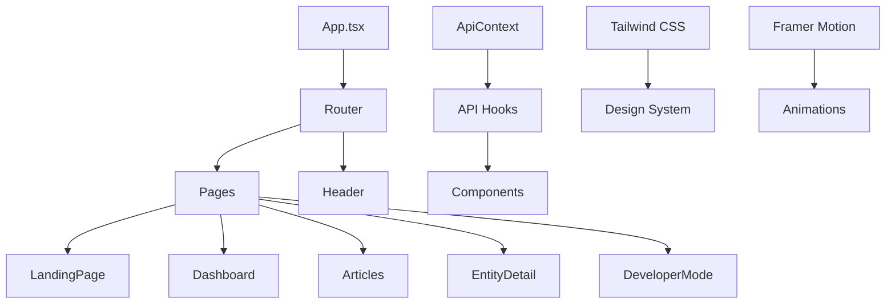

# 🌟 SentimentScope Frontend

<div align="center">


**Modern React Dashboard for AI-Powered Financial Sentiment Analysis**

[](https://reactjs.org)
[](https://typescriptlang.org)
[](https://vitejs.dev)
[](https://tailwindcss.com)
[](https://framer.com/motion)

[🚀 Live Demo](https://your-demo-url.com) • [📖 Documentation](https://docs.your-domain.com) • [🐛 Report Bug](https://github.com/your-repo/issues) • [✨ Request Feature](https://github.com/your-repo/issues)

</div>

---

## 📋 Table of Contents

- [🌟 Overview](#-overview)
- [✨ Features](#-features)
- [🎨 Design System](#-design-system)
- [🚀 Quick Start](#-quick-start)
- [📁 Project Structure](#-project-structure)
- [🔧 Configuration](#-configuration)
- [🎯 Core Components](#-core-components)
- [📱 Responsive Design](#-responsive-design)
- [🎭 Animations](#-animations)
- [🔌 API Integration](#-api-integration)
- [🛠️ Development](#️-development)
- [📦 Build & Deploy](#-build--deploy)
- [🧪 Testing](#-testing)
- [🎨 Customization](#-customization)
- [🐛 Troubleshooting](#-troubleshooting)
- [🤝 Contributing](#-contributing)
- [📄 License](#-license)

---

## 🌟 Overview

SentimentScope Frontend is a cutting-edge React application that provides an intuitive and powerful interface for financial news sentiment analysis. Built with modern web technologies, it offers real-time insights, interactive visualizations, and a seamless user experience for tracking market sentiment across companies and cryptocurrencies.

### 🎯 Key Highlights

- **🚀 Lightning Fast**: Built with Vite for instant development and optimized production builds
- **📱 Fully Responsive**: Seamless experience across desktop, tablet, and mobile devices
- **🎨 Beautiful UI**: Modern design with smooth animations and micro-interactions
- **📊 Interactive Charts**: Real-time sentiment visualization with Recharts
- **🔍 Smart Search**: Intelligent entity detection and filtering
- **⚡ Real-time Updates**: Live data synchronization with the backend API
- **🎭 Smooth Animations**: Delightful user experience with Framer Motion

---

## ✨ Features

### 🏠 Landing Page
- **Hero Section**: Compelling introduction with dynamic news carousel
- **Feature Showcase**: Highlighted capabilities and benefits
- **Live News Feed**: Real-time financial news with sentiment indicators
- **Call-to-Action**: Seamless navigation to dashboard

### 📊 Dashboard
- **Overview Statistics**: Key metrics and sentiment distribution
- **Top Entities**: Ranked companies and cryptocurrencies by sentiment
- **Trend Visualization**: Interactive charts showing sentiment over time
- **Quick Actions**: Fast access to detailed analysis

### 📰 Articles Page
- **Advanced Filtering**: Multi-criteria search and filtering
- **Sentiment Analysis**: Dual sentiment scoring (financial & overall)
- **Entity Recognition**: Automatic company/crypto detection
- **Detailed View**: Full article content with AI reasoning
- **Infinite Scroll**: Smooth pagination for large datasets

### 🏢 Entity Detail Pages
- **Comprehensive Analysis**: Deep dive into individual entities
- **Sentiment Trends**: Historical sentiment tracking
- **AI Summaries**: Generated insights and key points
- **Related Articles**: Contextual article recommendations
- **Interactive Charts**: Visual sentiment distribution

### ⚙️ Developer Mode
- **API Testing**: Interactive endpoint testing
- **Pipeline Control**: Manual trigger and monitoring
- **Usage Analytics**: Cost and performance metrics
- **System Status**: Real-time health monitoring

---

## 🎨 Design System

### 🎨 Color Palette

```css
/* Primary Colors */
--primary-50: #f0f9ff;
--primary-500: #0ea5e9;
--primary-900: #0c4a6e;

/* Semantic Colors */
--success: #22c55e;
--warning: #f59e0b;
--error: #ef4444;
--neutral: #64748b;
```

### 🌈 Gradient System

```css
/* Brand Gradients */
.news-gradient { background: linear-gradient(135deg, #0ea5e9 0%, #6366f1 100%); }
.primary-gradient { background: linear-gradient(135deg, #0ea5e9 0%, #6366f1 100%); }
.success-gradient { background: linear-gradient(135deg, #22c55e 0%, #15803d 100%); }
.error-gradient { background: linear-gradient(135deg, #ef4444 0%, #b91c1c 100%); }
```

### 📝 Typography

```css
/* Font Family */
font-family: 'Inter', sans-serif;

/* Font Weights */
--font-light: 300;
--font-normal: 400;
--font-medium: 500;
--font-semibold: 600;
--font-bold: 700;
```

### 🎭 Animation System

```css
/* Custom Animations */
@keyframes float { /* Floating elements */ }
@keyframes glow { /* Glowing effects */ }
@keyframes gradient { /* Gradient animations */ }
```

---

## 🚀 Quick Start

### 📋 Prerequisites

```bash
# Node.js 18+ and npm
node --version  # v18.0.0+
npm --version   # v8.0.0+

# Or use Yarn
yarn --version  # v1.22.0+
```

### ⚡ Installation

1. **Clone Repository**
   ```bash
   git clone <repository-url>
   cd sentimentscope-frontend
   ```

2. **Install Dependencies**
   ```bash
   npm install
   # or
   yarn install
   ```

3. **Environment Setup**
   ```bash
   # Create environment file
   cp .env.example .env.local
   
   # Configure API endpoint
   echo "VITE_API_BASE_URL=http://localhost:5000" >> .env.local
   ```

4. **Start Development Server**
   ```bash
   npm run dev
   # or
   yarn dev
   ```

5. **Open Browser**
   ```
   http://localhost:5173
   ```

### 🌐 Verify Installation

- ✅ Landing page loads with animations
- ✅ Navigation works smoothly
- ✅ Dashboard displays data (requires backend)
- ✅ Responsive design on mobile

---

## 📁 Project Structure

```
src/
├── 📄 App.tsx                   # Main application component
├── 📄 main.tsx                  # Application entry point
├── 📄 index.css                 # Global styles and Tailwind imports
├── 📄 vite-env.d.ts            # Vite type definitions
│
├── 📁 components/               # Reusable UI components
│   ├── 📄 Header.tsx           # Navigation header
│   ├── 📄 ArticleCard.tsx      # Article display component
│   ├── 📄 ArticleModal.tsx     # Full article modal
│   ├── 📄 CompanyCard.tsx      # Entity overview card
│   ├── 📄 EntityCard.tsx       # Entity list item
│   ├── 📄 FilterPanel.tsx      # Search and filter controls
│   ├── 📄 SearchBar.tsx        # Search input component
│   ├── 📄 StatsCard.tsx        # Statistics display
│   ├── 📄 LoadingStates.tsx    # Loading and skeleton components
│   └── 📄 ResponsiveLayout.tsx # Layout utilities
│
├── 📁 pages/                    # Page components
│   ├── 📄 LandingPage.tsx      # Home/landing page
│   ├── 📄 Dashboard.tsx        # Main dashboard
│   ├── 📄 Articles.tsx         # Articles listing
│   ├── 📄 EntityDetail.tsx     # Individual entity analysis
│   └── 📄 DeveloperMode.tsx    # Developer tools
│
├── 📁 contexts/                 # React contexts
│   └── 📄 ApiContext.tsx       # API configuration and utilities
│
├── 📁 hooks/                    # Custom React hooks
│   └── 📄 useApi.ts            # API interaction hooks
│
└── 📁 utils/                    # Utility functions
    └── 📄 entityDetection.ts   # Entity type detection
```

### 🏗️ Architecture Overview



---

## 🔧 Configuration

### 🌍 Environment Variables

Create `.env.local` file:

```env
# API Configuration
VITE_API_BASE_URL=http://localhost:5000

# Feature Flags
VITE_ENABLE_DEVELOPER_MODE=true
VITE_ENABLE_ANALYTICS=false

# Performance
VITE_CACHE_DURATION=300000
VITE_REQUEST_TIMEOUT=10000
```

### ⚙️ Vite Configuration

```typescript
// vite.config.ts
export default defineConfig({
  plugins: [react()],
  optimizeDeps: {
    exclude: ['lucide-react'],
  },
  server: {
    port: 5173,
    proxy: {
      '/api': 'http://localhost:5000'
    }
  }
});
```

### 🎨 Tailwind Configuration

```javascript
// tailwind.config.js
module.exports = {
  content: ['./index.html', './src/**/*.{js,ts,jsx,tsx}'],
  theme: {
    extend: {
      fontFamily: {
        'inter': ['Inter', 'sans-serif'],
      },
      colors: {
        primary: { /* Custom color palette */ },
        success: { /* Success colors */ },
        // ... more colors
      },
      backgroundImage: {
        'news-gradient': 'linear-gradient(135deg, #0ea5e9 0%, #6366f1 100%)',
        // ... more gradients
      },
      animation: {
        'float': 'float 6s ease-in-out infinite',
        'glow': 'glow 2s ease-in-out infinite alternate',
        // ... more animations
      }
    },
  },
  plugins: [],
}
```

---

## 🎯 Core Components

### 🏠 Header Component

```typescript
// Navigation with responsive design
<Header />
```

**Features:**
- 📱 Mobile-responsive navigation
- 🎨 Gradient logo with hover effects
- 🔗 Active route highlighting
- 📱 Mobile hamburger menu

### 📰 ArticleCard Component

```typescript
// Article display with sentiment analysis
<ArticleCard 
  article={article}
  index={index}
  onReadMore={handleReadMore}
/>
```

**Features:**
- 📊 Dual sentiment display
- 👤 Author and date information
- 🔗 External link handling
- 📱 Responsive layout
- ⏱️ Reading time estimation

### 🏢 EntityCard Component

```typescript
// Entity overview with sentiment distribution
<EntityCard entity={entity} />
```

**Features:**
- 🎨 Dynamic entity type icons
- 📊 Sentiment distribution bar
- 🔗 Navigation to detail page
- 📱 Mobile-optimized layout

### 📊 CompanyCard Component

```typescript
// Detailed entity analysis
<CompanyCard 
  entityName={name}
  entityType={type}
/>
```

**Features:**
- 📈 Sentiment statistics
- 🤖 AI-generated summaries
- 📰 Recent articles preview
- 📊 Trend indicators

---

## 📱 Responsive Design

### 📐 Breakpoint System

```css
/* Tailwind CSS Breakpoints */
sm: 640px   /* Small devices */
md: 768px   /* Medium devices */
lg: 1024px  /* Large devices */
xl: 1280px  /* Extra large devices */
2xl: 1536px /* 2X large devices */
```

### 📱 Mobile-First Approach

```typescript
// Responsive grid example
<div className="grid grid-cols-1 md:grid-cols-2 lg:grid-cols-3 gap-6">
  {/* Content adapts to screen size */}
</div>

// Responsive text
<h1 className="text-2xl sm:text-3xl md:text-4xl lg:text-5xl">
  Responsive Heading
</h1>
```

### 🎨 Responsive Components

- **ResponsiveContainer**: Max-width container with padding
- **ResponsiveGrid**: Adaptive grid layouts
- **MobileDrawer**: Mobile-specific navigation
- **ResponsiveCard**: Adaptive card components

---

## 🎭 Animations

### ✨ Framer Motion Integration

```typescript
// Page transitions
<motion.div
  initial={{ opacity: 0, y: 20 }}
  animate={{ opacity: 1, y: 0 }}
  transition={{ duration: 0.6 }}
>
  {/* Content */}
</motion.div>

// Staggered animations
<motion.div
  initial={{ y: 20, opacity: 0 }}
  animate={{ y: 0, opacity: 1 }}
  transition={{ duration: 0.6, delay: index * 0.1 }}
>
  {/* Staggered items */}
</motion.div>
```

### 🎨 Custom CSS Animations

```css
/* Floating animation */
@keyframes float {
  0%, 100% { transform: translateY(0px); }
  50% { transform: translateY(-20px); }
}

/* Glow effect */
@keyframes glow {
  0% { box-shadow: 0 0 20px rgba(14, 165, 233, 0.5); }
  100% { box-shadow: 0 0 30px rgba(14, 165, 233, 0.8); }
}
```

### 🎪 Animation Patterns

- **Page Entrance**: Fade in with slide up
- **Card Hover**: Scale and shadow effects
- **Loading States**: Skeleton animations
- **Micro-interactions**: Button hover effects
- **Background Elements**: Floating gradients

---

## 🔌 API Integration

### 🌐 API Context

```typescript
// API configuration and utilities
const ApiContext = createContext<ApiContextType>({
  apiBaseUrl: 'http://localhost:5000/api',
  fetchData: async (endpoint, params) => { /* ... */ }
});
```

### 🎣 Custom Hooks

```typescript
// useApiWithCache hook
const { fetchWithCache, loading, error } = useApiWithCache({
  cacheTime: 5 * 60 * 1000, // 5 minutes
  retries: 3,
  retryDelay: 1000
});

// Usage example
const articles = await fetchWithCache('/articles', { 
  entity_name: 'Apple',
  limit: 20 
});
```

### 📡 API Endpoints Integration

```typescript
// Articles API
GET /api/articles
GET /api/articles?entity_name=Apple&entity_type=company

// Entities API  
GET /api/entities
GET /api/top_entities?sentiment_type=overall&sentiment=positive

// Analytics API
GET /api/sentiment_over_time?entity_name=Tesla
GET /api/dashboard_stats
GET /api/summarize_entity?entity_name=Bitcoin
```

### 🔄 Error Handling

```typescript
// Comprehensive error handling
try {
  const data = await fetchData('/articles');
  setArticles(data);
} catch (error) {
  console.error('API Error:', error);
  setError('Failed to load articles. Please try again.');
  // Show user-friendly error message
}
```

---

## 🛠️ Development

### 🚀 Development Server

```bash
# Start development server
npm run dev

# With specific port
npm run dev -- --port 3000

# With host binding
npm run dev -- --host 0.0.0.0
```

### 🔧 Development Tools

```bash
# TypeScript checking
npm run type-check

# Linting
npm run lint
npm run lint:fix

# Formatting
npm run format

# Bundle analysis
npm run analyze
```

### 🧪 Hot Module Replacement

Vite provides instant HMR for:
- ⚡ React components
- 🎨 CSS/Tailwind changes
- 📝 TypeScript updates
- 🖼️ Asset changes

### 🔍 Debugging

```typescript
// React Developer Tools
// Install browser extension for component inspection

// Console debugging
console.log('API Response:', data);

// Network debugging
// Use browser DevTools Network tab

// Performance debugging
// Use React Profiler
```

---

## 📦 Build & Deploy

### 🏗️ Production Build

```bash
# Create production build
npm run build

# Preview production build
npm run preview

# Build with analysis
npm run build -- --analyze
```

### 📊 Build Optimization

```typescript
// Vite automatically optimizes:
// - Code splitting
// - Tree shaking
// - Asset optimization
// - CSS minification
// - Image optimization
```

### 🚀 Deployment Options

#### Netlify Deployment
```bash
# Build command
npm run build

# Publish directory
dist

# Environment variables
VITE_API_BASE_URL=https://your-api-domain.com
```

#### Vercel Deployment
```bash
# Install Vercel CLI
npm i -g vercel

# Deploy
vercel

# Production deployment
vercel --prod
```

#### Docker Deployment
```dockerfile
# Dockerfile
FROM node:18-alpine
WORKDIR /app
COPY package*.json ./
RUN npm ci --only=production
COPY . .
RUN npm run build
EXPOSE 3000
CMD ["npm", "run", "preview"]
```

### 🌍 Environment Configuration

```bash
# Development
VITE_API_BASE_URL=http://localhost:5000

# Staging
VITE_API_BASE_URL=https://staging-api.your-domain.com

# Production
VITE_API_BASE_URL=https://api.your-domain.com
```

---

## 🧪 Testing

### 🔬 Testing Setup

```bash
# Install testing dependencies
npm install -D @testing-library/react @testing-library/jest-dom vitest

# Run tests
npm run test

# Watch mode
npm run test:watch

# Coverage report
npm run test:coverage
```

### 🧪 Component Testing

```typescript
// Example component test
import { render, screen } from '@testing-library/react';
import { ArticleCard } from '../components/ArticleCard';

test('renders article title', () => {
  const mockArticle = {
    id: 1,
    title: 'Test Article',
    author: 'Test Author',
    // ... more props
  };
  
  render(<ArticleCard article={mockArticle} index={0} onReadMore={jest.fn()} />);
  expect(screen.getByText('Test Article')).toBeInTheDocument();
});
```

### 🔍 E2E Testing

```typescript
// Cypress example
describe('Dashboard', () => {
  it('loads dashboard with data', () => {
    cy.visit('/dashboard');
    cy.contains('Financial News Intelligence');
    cy.get('[data-testid="stats-card"]').should('be.visible');
  });
});
```

---

## 🎨 Customization

### 🎨 Theme Customization

```typescript
// Extend Tailwind theme
module.exports = {
  theme: {
    extend: {
      colors: {
        brand: {
          50: '#your-color',
          // ... custom color scale
        }
      },
      fontFamily: {
        'custom': ['Your Font', 'sans-serif'],
      }
    }
  }
}
```

### 🧩 Component Customization

```typescript
// Custom component variants
const Button = ({ variant = 'primary', size = 'md', ...props }) => {
  const variants = {
    primary: 'bg-primary-gradient text-white',
    secondary: 'bg-secondary-gradient text-white',
    outline: 'border-2 border-primary-500 text-primary-500'
  };
  
  const sizes = {
    sm: 'px-3 py-1.5 text-sm',
    md: 'px-4 py-2 text-base',
    lg: 'px-6 py-3 text-lg'
  };
  
  return (
    <button 
      className={`${variants[variant]} ${sizes[size]} rounded-lg font-semibold transition-all duration-300`}
      {...props}
    />
  );
};
```

### 🎭 Animation Customization

```css
/* Custom animations */
@keyframes customSlide {
  0% { transform: translateX(-100%); }
  100% { transform: translateX(0); }
}

.custom-slide {
  animation: customSlide 0.5s ease-out;
}
```

---

## 🐛 Troubleshooting

### ❌ Common Issues

#### Build Errors
```bash
# Clear node_modules and reinstall
rm -rf node_modules package-lock.json
npm install

# Clear Vite cache
rm -rf node_modules/.vite
npm run dev
```

#### API Connection Issues
```typescript
// Check API endpoint
console.log('API Base URL:', import.meta.env.VITE_API_BASE_URL);

// Test API connectivity
fetch(`${apiBaseUrl}/`)
  .then(response => response.json())
  .then(data => console.log('API Response:', data))
  .catch(error => console.error('API Error:', error));
```

#### TypeScript Errors
```bash
# Check TypeScript configuration
npx tsc --noEmit

# Update type definitions
npm update @types/react @types/react-dom
```

#### Performance Issues
```typescript
// Use React.memo for expensive components
const ExpensiveComponent = React.memo(({ data }) => {
  // Component logic
});

// Lazy load components
const LazyComponent = React.lazy(() => import('./LazyComponent'));
```

### 🔍 Debug Mode

```typescript
// Enable debug logging
if (import.meta.env.DEV) {
  console.log('Debug mode enabled');
  // Additional debug information
}
```

### 📞 Getting Help

- **GitHub Issues**: Report bugs and request features
- **Documentation**: Check the docs for detailed guides
- **Community**: Join our Discord/Slack for support
- **Stack Overflow**: Tag questions with `sentimentscope`

---

## 🤝 Contributing

### 🚀 Getting Started

1. **Fork the Repository**
   ```bash
   git clone https://github.com/your-username/sentimentscope-frontend.git
   cd sentimentscope-frontend
   ```

2. **Create Feature Branch**
   ```bash
   git checkout -b feature/amazing-feature
   ```

3. **Make Changes**
   ```bash
   # Follow coding standards
   npm run lint
   npm run format
   npm run type-check
   ```

4. **Test Changes**
   ```bash
   npm run test
   npm run build
   ```

5. **Submit Pull Request**
   ```bash
   git push origin feature/amazing-feature
   # Create PR on GitHub
   ```

### 📝 Coding Standards

```typescript
// Use TypeScript for type safety
interface Props {
  title: string;
  optional?: boolean;
}

// Use functional components with hooks
const Component: React.FC<Props> = ({ title, optional = false }) => {
  const [state, setState] = useState<string>('');
  
  return (
    <div className="component-class">
      {/* JSX content */}
    </div>
  );
};

// Export default at bottom
export default Component;
```

### 🎨 Design Guidelines

- **Consistency**: Follow existing design patterns
- **Accessibility**: Ensure WCAG compliance
- **Performance**: Optimize for speed and efficiency
- **Mobile-First**: Design for mobile, enhance for desktop

---

## 📈 Performance

### ⚡ Optimization Techniques

```typescript
// Code splitting
const LazyPage = React.lazy(() => import('./LazyPage'));

// Memoization
const MemoizedComponent = React.memo(Component);

// Virtual scrolling for large lists
import { FixedSizeList as List } from 'react-window';
```

### 📊 Performance Metrics

| Metric | Target | Current |
|--------|--------|---------|
| **First Contentful Paint** | < 1.5s | ~1.2s |
| **Largest Contentful Paint** | < 2.5s | ~2.1s |
| **Cumulative Layout Shift** | < 0.1 | ~0.05 |
| **Time to Interactive** | < 3.5s | ~2.8s |

### 🔧 Performance Tools

```bash
# Lighthouse audit
npm run lighthouse

# Bundle analyzer
npm run analyze

# Performance profiling
# Use React DevTools Profiler
```

---

## 🔮 Roadmap

### 🎯 Upcoming Features

- [ ] **Dark Mode**: Complete dark theme implementation
- [ ] **PWA Support**: Progressive Web App capabilities
- [ ] **Offline Mode**: Cached data for offline viewing
- [ ] **Real-time Updates**: WebSocket integration
- [ ] **Advanced Filters**: More sophisticated filtering options
- [ ] **Export Features**: PDF/CSV export functionality
- [ ] **Notifications**: Push notifications for alerts
- [ ] **Multi-language**: Internationalization support

### 🚀 Technical Improvements

- [ ] **Performance**: Further optimization and caching
- [ ] **Accessibility**: Enhanced WCAG compliance
- [ ] **Testing**: Increased test coverage
- [ ] **Documentation**: Interactive component docs
- [ ] **CI/CD**: Automated testing and deployment

---

## 📄 License

This project is licensed under the MIT License - see the [LICENSE](LICENSE) file for details.

---

<div align="center">

**Built with ❤️ for Rohitw3code**

[](https://github.com/your-repo)
[](https://your-demo-url.com)
[](https://docs.your-domain.com)

### 🌟 Star us on GitHub if this project helped you!

</div>